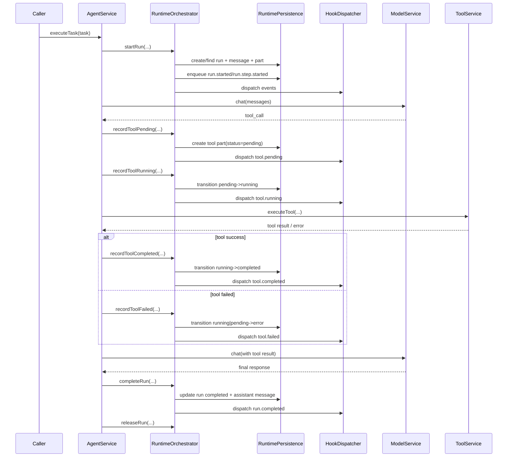
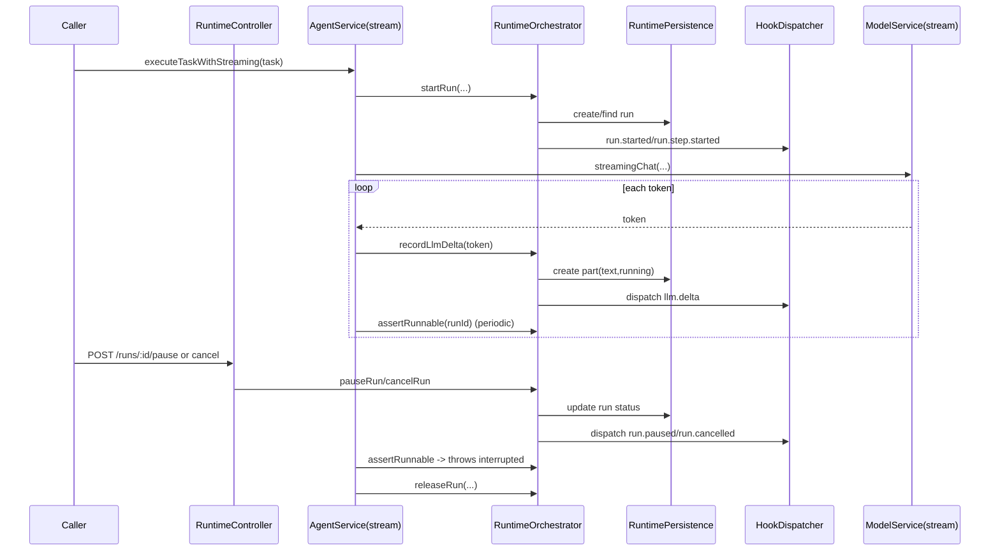

# Agent Runtime 工作流程技术设计

## 1. 文档目的

本文基于当前已落地实现，说明 Agent Runtime 在本项目中的执行流程、状态模型、控制面与运维面设计，帮助开发者快速理解：

- 一次任务如何从触发到完成
- 中间状态如何持久化与外发
- 外部如何控制 run（暂停/恢复/取消/回放）
- 失败事件如何治理（dead-letter/requeue）

核心代码入口：

- `backend/apps/agents/src/modules/agents/agent.service.ts`
- `backend/apps/agents/src/modules/runtime/runtime-orchestrator.service.ts`
- `backend/apps/agents/src/modules/runtime/runtime-persistence.service.ts`
- `backend/apps/agents/src/modules/runtime/hook-dispatcher.service.ts`
- `backend/apps/agents/src/modules/runtime/runtime.controller.ts`

---

## 2. 设计目标与边界

### 2.1 目标

- 将 Agent 执行过程从“单次响应”升级为“可观测运行时”
- 统一事件化：run / llm / tool 生命周期都有标准事件
- 运行过程可恢复、可回放、可治理
- 提供运行维护能力（死信查看、重投、维护审计）

### 2.2 当前边界

- run 锁当前为**进程内 single-flight**（非分布式锁）
- 旧 session 数据策略为**不迁移，维护接口清理**
- 测试链路当前以 build 验证为主（自动化测试后续补齐）

---

## 3. 模块与职责划分

### 3.1 RuntimeOrchestratorService

职责：运行编排与状态推进。

- `startRun/releaseRun`：创建或续接 run，并管理执行锁
- `completeRun/failRun`：结束态落库 + 事件外发
- `recordLlmDelta`：流式 token 增量事件
- `recordTool*`：工具调用状态机（pending/running/completed/failed）
- `pause/resume/cancel/replay`：控制面能力

### 3.2 RuntimePersistenceService

职责：运行时持久化与查询。

- run/message/part/outbox/audit 五类数据的增删改查
- outbox 分发状态变更、重试查询
- dead-letter 查询/重投
- 维护审计落库与查询

### 3.3 HookDispatcherService

职责：事件外发与补偿分发。

- 即时发布事件（Redis Pub/Sub）
- 启动定时 flush outbox 失败/待发事件
- 维护发布指标（published/failed/replayPublished 等）

### 3.4 RuntimeController

职责：运行控制与运维接口。

- run 控制 API
- dead-letter 导出与重投 API
- 维护审计查询 API
- legacy 清理 API（system-only）

---

## 4. 数据模型设计

路径：`backend/apps/agents/src/schemas/`

- `agent_runs`（`agent-run.schema.ts`）
  - run 主记录：状态、步骤、起止时间、错误
- `agent_messages`（`agent-message.schema.ts`）
  - 对话级消息（user/assistant/tool/system）
- `agent_parts`（`agent-part.schema.ts`）
  - 细粒度片段与步骤，承载 tool/llm 增量
- `agent_events_outbox`（`agent-event-outbox.schema.ts`）
  - 事件可靠外发队列（pending/dispatched/failed）
- `agent_runtime_maintenance_audits`（`agent-runtime-maintenance-audit.schema.ts`）
  - 维护行为审计（batchId、actor、scope、result、summary）

---

## 5. 主流程设计（执行态）

### 5.1 非流式任务流程

1. `AgentService.executeTask` 组装任务上下文与模型参数。
2. 调用 `runtimeOrchestrator.startRun`：
   - 获取/创建 run
   - 建立 user message + part
   - 发送 `run.started` 或 `run.resumed`
   - 发送 `run.step.started`
3. 模型与工具循环执行（`executeWithToolCalling`）。
4. 成功时 `completeRun`：落 assistant message/part，发送 `run.completed`。
5. 失败时 `failRun`：更新 run.failed，发送 `run.failed`。
6. `finally` 中 `releaseRun` 释放锁。

### 5.2 流式任务流程

1. `executeTaskWithStreaming` 同样先 `startRun`。
2. streaming 回调中：
   - 向调用方输出 token
   - 调用 `recordLlmDelta` 落 part + 发送 `llm.delta`
   - 周期性 `assertRunnable`，支持中途 pause/cancel 打断
3. 完成后 `completeRun`，异常走 `failRun`（控制类中断不会误记 failed）。

---

## 6. 工具调用状态机

工具状态通过同一 `partId` 严格迁移：

- `recordToolPending`：创建 `tool_call` part，状态 `pending`
- `recordToolRunning`：`pending -> running`
- `recordToolCompleted`：`running -> completed`
- `recordToolFailed`：`running|pending -> error`

非法迁移直接抛错，避免状态被覆盖污染。

---

## 7. 事件外发与可靠性

### 7.1 事件生成

`emitEvent` 会统一：

- 生成 `eventId`
- 补齐 `traceId`
- 先写 outbox，再 dispatch

### 7.2 分发机制

- 默认 channel：
  - 有组织：`agent-runtime:{organizationId}`
  - 否则：`agent-runtime:{agentId}`
- Redis 不可用会标记 outbox failed
- dispatcher 每 2 秒 flush 一次可派发事件

### 7.3 replay

可按 `eventTypes/fromSequence/toSequence/channel/limit` 重放 run 历史事件，且不影响 outbox 原始状态字段。

---

## 8. 控制面与权限模型

接口前缀：`/agents/runtime`

- run 控制：`runs/:runId` + `pause/resume/cancel/replay`
- 观测：`metrics`
- dead-letter：`outbox/dead-letter` + `outbox/dead-letter/requeue`
- 维护：`maintenance/audits` + `maintenance/purge-legacy`

权限约束：

- 角色白名单：`system/admin/owner`
- 非 system 受组织隔离约束（不能跨组织操作 run 或运维数据）
- `purge-legacy` 必须 `system` + `confirm=DELETE_LEGACY_RUNTIME_DATA`

---

## 9. 运维流程设计

### 9.1 dead-letter 处理

1. 先 `GET outbox/dead-letter` 查看范围和数量（`total/returned/hasMore`）。
2. 再 `POST outbox/dead-letter/requeue`，优先小范围（runId/eventType）。
3. 可先 `dryRun=true` 预估影响。
4. 通过返回 `batchId` 在 `GET maintenance/audits` 回查结果。

### 9.2 legacy 数据清理

1. `POST maintenance/purge-legacy` dry-run。
2. 校验目标 collections。
3. 正式执行并记录维护审计（含 batchId）。

---

## 10. 可观测性

`GET /agents/runtime/metrics` 返回：

- hook dispatcher 指标：
  - `published`
  - `failed`
  - `replayPublished`
  - `replayFailed`
  - `flushRuns`
  - `lastFlushAt`
  - `queueFlushing`
- outbox 概览：`pending/failed/dispatched`
- dead-letter 摘要：`totalFailed/oldestFailedAt`

---

## 11. 设计取舍说明

- 先做“运行稳定性与治理能力”而非“功能面扩展”。
- 采用 outbox + replay + maintenance audit，优先解决可恢复与可追责。
- 旧数据不迁移，降低切流复杂度；通过 purge 接口完成治理闭环。

---

## 12. 后续演进建议（未执行）

- 将 run 锁升级为 Redis 分布式锁（多实例一致性）
- 增强 outbox 投递幂等元数据（deliveryId/attemptId）
- 增加 run 级状态迁移矩阵守卫
- 为 replay/requeue/purge 增加限流防抖

---

## 13. 时序图（简化）

### 13.1 普通任务执行（含工具调用）

### 13.2 流式执行与控制面打断

