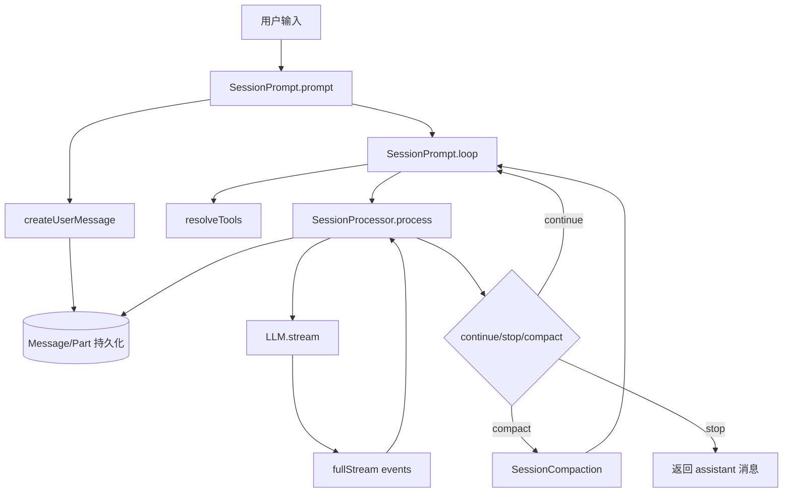

# LLM 流式循环 + 工具执行 + 状态持久化（OpenCode）

本文面向工程实现，梳理 OpenCode 当前会话引擎里这三件核心能力如何协同：

- LLM 流式循环（Streaming Loop）
- 工具执行（Tool Execution）
- 状态持久化（State Persistence）

---

## 1. 架构设计

### 1.1 分层视角

整体可以拆成 6 层：

| 层       | 主要模块                                                                                 | 核心职责                                       | 边界                 |
| -------- | ---------------------------------------------------------------------------------------- | ---------------------------------------------- | -------------------- |
| 编排层   | `packages/opencode/src/session/prompt.ts`                                                | 驱动会话主循环、步进、终止、压缩切换           | 不处理 provider 细节 |
| 执行层   | `packages/opencode/src/session/processor.ts`                                             | 消费流式事件并映射为 message/part 状态         | 不做工具注册         |
| 模型层   | `packages/opencode/src/session/llm.ts`                                                   | 组装 system/messages/tools 并调用 `streamText` | 不直接写库           |
| 工具层   | `packages/opencode/src/tool/registry.ts`                                                 | 汇总内置/插件工具，做模型差异路由              | 不做最终授权决策     |
| 权限层   | `packages/opencode/src/permission/next.ts`                                               | `allow/ask/deny` 规则评估与审批闭环            | 不执行业务逻辑       |
| 持久化层 | `packages/opencode/src/session/index.ts` + `packages/opencode/src/session/message-v2.ts` | 统一 message/part schema 与写库广播            | 不感知 provider 细节 |

### 1.2 核心执行链路



### 1.3 关键状态机

工具 part 在 `MessageV2` 中是显式状态机：

- `pending`：模型已声明工具输入，待执行
- `running`：工具正在执行
- `completed`：有输出（`output/metadata/attachments`）
- `error`：执行失败或中断

这个状态机使 UI、恢复、审计都可以只依赖持久化数据，而不用依赖 provider 原始流。

---

## 2. 核心代码

### 2.1 主循环编排（`session/prompt.ts`）

文件：`packages/opencode/src/session/prompt.ts`

```ts
export const loop = fn(LoopInput, async (input) => {
  const { sessionID, resume_existing } = input
  const abort = resume_existing ? resume(sessionID) : start(sessionID)

  if (!abort) {
    return new Promise<MessageV2.WithParts>((resolve, reject) => {
      const callbacks = state()[sessionID].callbacks
      callbacks.push({ resolve, reject })
    })
  }

  using _ = defer(() => cancel(sessionID))
  let structuredOutput: unknown | undefined
  let step = 0

  while (true) {
    let msgs = await MessageV2.filterCompacted(MessageV2.stream(sessionID))
    // ...识别 lastUser / lastAssistant / pending task

    const result = await processor.process({
      /* model/messages/tools/system */
    })

    if (structuredOutput !== undefined) break
    if (result === "stop") break
    if (result === "compact") {
      await SessionCompaction.create({ sessionID, agent: lastUser.agent, model: lastUser.model, auto: true })
    }
  }
})
```

解读：

- `loop` 是全局编排器，负责“是否进入下一步”的决策。
- 通过 `start/resume/cancel` 控制会话并发与重入。
- 将复杂行为拆成结果枚举：`continue/stop/compact`，避免主流程分支爆炸。

### 2.2 流式事件消费（`session/processor.ts`）

文件：`packages/opencode/src/session/processor.ts`

```ts
for await (const value of stream.fullStream) {
  input.abort.throwIfAborted()
  switch (value.type) {
    case "tool-call": {
      const match = toolcalls[value.toolCallId]
      if (match) {
        await Session.updatePart({
          ...match,
          state: { status: "running", input: value.input, time: { start: Date.now() } },
        })
      }
      break
    }

    case "tool-result": {
      const match = toolcalls[value.toolCallId]
      if (match && match.state.status === "running") {
        await Session.updatePart({
          ...match,
          state: {
            status: "completed",
            input: value.input ?? match.state.input,
            output: value.output.output,
            metadata: value.output.metadata,
            title: value.output.title,
            time: { start: match.state.time.start, end: Date.now() },
            attachments: value.output.attachments,
          },
        })
      }
      break
    }
  }
}
```

解读：

- `processor` 不是“业务逻辑层”，而是“事件 -> 状态”的转换器。
- 所有中间态都落盘（包括 reasoning/text/tool），因此可恢复、可观测、可审计。
- 出错时统一落到 part/message 错误状态，避免悬挂工具。

### 2.3 LLM 参数装配（`session/llm.ts`）

文件：`packages/opencode/src/session/llm.ts`

```ts
const tools = await resolveTools(input)

return streamText({
  activeTools: Object.keys(tools).filter((x) => x !== "invalid"),
  tools,
  toolChoice: input.toolChoice,
  abortSignal: input.abort,
  messages: [...system.map((x) => ({ role: "system", content: x })), ...input.messages],
  model: wrapLanguageModel({
    model: language,
    middleware: [
      /* transformParams */
    ],
  }),
})
```

解读：

- 模型层核心职责是协议适配，不直接处理持久化。
- 工具可见性在此二次过滤，确保权限禁用真正传导到 provider。
- 支持 provider 差异处理（headers、max tokens、tool call 修复等）。

### 2.4 工具注册（`tool/registry.ts`）

文件：`packages/opencode/src/tool/registry.ts`

```ts
export async function tools(model, agent) {
  const tools = await all()
  const result = await Promise.all(
    tools
      .filter((t) => {
        const usePatch =
          model.modelID.includes("gpt-") && !model.modelID.includes("oss") && !model.modelID.includes("gpt-4")
        if (t.id === "apply_patch") return usePatch
        if (t.id === "edit" || t.id === "write") return !usePatch
        return true
      })
      .map(async (t) => ({ id: t.id, ...(await t.init({ agent })) })),
  )
  return result
}
```

解读：

- 一处汇总工具，一处做模型兼容路由。
- 将“工具实现”和“工具装配策略”分开，降低变更耦合。

### 2.5 权限审批（`permission/next.ts`）

文件：`packages/opencode/src/permission/next.ts`

```ts
export const ask = fn(Request.partial({ id: true }).extend({ ruleset: Ruleset }), async (input) => {
  for (const pattern of input.patterns ?? []) {
    const rule = evaluate(input.permission, pattern, input.ruleset, s.approved)
    if (rule.action === "deny") throw new DeniedError(...)
    if (rule.action === "ask") {
      return new Promise<void>((resolve, reject) => {
        s.pending[id] = { info, resolve, reject }
        Bus.publish(Event.Asked, info)
      })
    }
  }
})
```

解读：

- 权限是异步流程，不是同步 bool。
- `ask -> reply` 形成闭环，支持 UI 人工确认与会话级批量放行。

### 2.6 持久化落点（`session/index.ts` + `message-v2.ts`）

文件：`packages/opencode/src/session/index.ts`

```ts
export const updateMessage = fn(MessageV2.Info, async (msg) => {
  Database.use((db) => {
    db.insert(MessageTable).values(...)
      .onConflictDoUpdate({ target: MessageTable.id, set: { data } })
      .run()
    Database.effect(() => Bus.publish(MessageV2.Event.Updated, { info: msg }))
  })
  return msg
})

export const updatePart = fn(UpdatePartInput, async (part) => {
  Database.use((db) => {
    db.insert(PartTable).values(...)
      .onConflictDoUpdate({ target: PartTable.id, set: { data } })
      .run()
    Database.effect(() => Bus.publish(MessageV2.Event.PartUpdated, { part: structuredClone(part) }))
  })
  return part
})
```

解读：

- message/part 采用 upsert，天然幂等，适合流式增量写。
- 写库后广播事件，前端可订阅增量更新。

---

## 3. 注意事项

### 3.1 并发与重入

- 同一 `sessionID` 必须单执行器；新请求应复用已有循环或排队回调。
- `abort` 必须贯穿 LLM、工具、重试等待，否则会出现“逻辑停止但资源未停”。

### 3.2 工具权限与安全

- 所有高风险工具必须显式 `ctx.ask(...)`，不要绕过权限层。
- 规则建议默认 `ask`，再针对低风险路径做精细 `allow`。
- 多工具并行时要避免“先执行后审批”竞态。

### 3.3 错误与重试

- 使用统一错误归一化（`MessageV2.fromError`），避免 provider 错误形态污染上层。
- 可重试错误使用指数退避；不可重试要立即落库并广播。
- 循环末尾要扫尾，将未终态工具标记为 `error`，防止 UI 长期 pending。

### 3.4 上下文压缩（Compaction）

- 压缩触发应基于 token 与模型上限，而不是仅消息数量。
- 压缩后的摘要需保留行动上下文（工具输出结论、未完成任务、关键约束）。
- 避免“压缩-再溢出-再压缩”震荡，必要时提高摘要质量或缩短历史窗口。

### 3.5 Structured Output

- JSON Schema 模式下，建议强制 `toolChoice: required` 并注入专用工具。
- 若模型未调用结构化工具就结束，必须显式报错，避免静默返回非结构化文本。

### 3.6 日志与可观测性

- 建议按 `sessionID/messageID/partID/tool/callID` 打 tag。
- 关键指标：每步 token/cost、工具成功率、重试次数、compaction 触发率、权限拒绝率。
- 对 `session.error`、`part.status=error`、长时 `pending/running` 做告警。

### 3.7 性能优化建议

- 优先控制工具输出体积（截断并外链路径），减少 DB 和前端渲染压力。
- 限制单步并发工具数，避免 event backlog。
- 对频繁读写路径启用批量/增量更新，避免全量对象重建。

---

## 排障清单（Checklist）

- [ ] 会话是否正确进入/退出 `busy` 状态
- [ ] 是否存在长时间 `pending` 或 `running` 的工具 part
- [ ] `permission.asked` 后是否有对应 `permission.replied`
- [ ] provider 错误是否被归一化并写入 assistant error
- [ ] `toModelMessages` 是否产出符合当前模型能力的内容
- [ ] JSON Schema 模式是否真实触发 `StructuredOutput` 工具
- [ ] compaction 是否过于频繁并导致质量下降
- [ ] 关键日志是否带齐 `sessionID/messageID/callID`

---

## 扩展建议：新增一个工具并接入循环

1. 在 `packages/opencode/src/tool/` 新建工具模块，实现参数 schema 和 `execute`。
2. 在 `packages/opencode/src/tool/registry.ts` 的 `all()` 注册工具，并按模型能力做必要过滤。
3. 在工具执行里通过 `ctx.ask(...)` 声明权限点（尤其是文件写入、命令执行、网络请求）。
4. 输出遵循 `{ title, output, metadata, attachments }`，大输出建议截断。
5. 不需要改主循环或处理器：`tool-call/tool-result/tool-error` 会自动进入既有状态机。
6. 增加集成验证：允许/拒绝/超时/大输出四类场景，检查 part 是否都进入终态。
