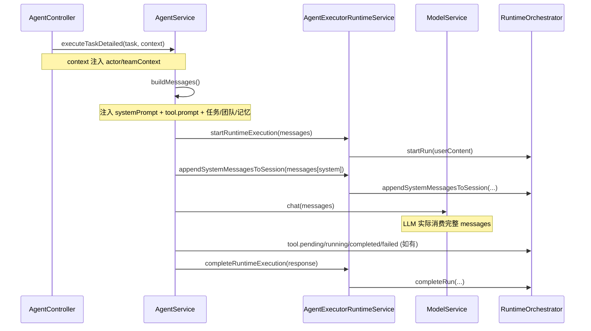
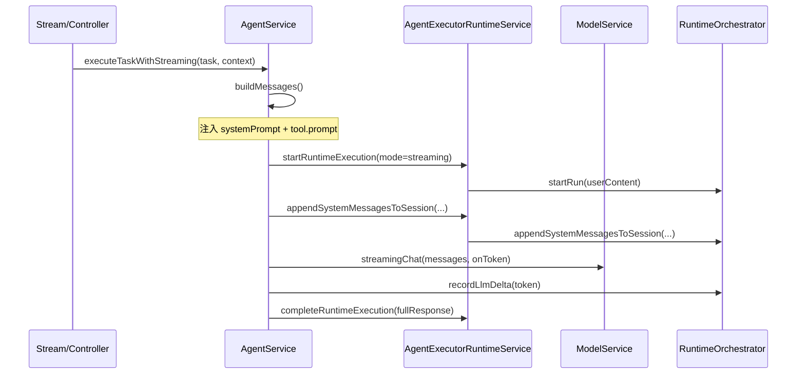
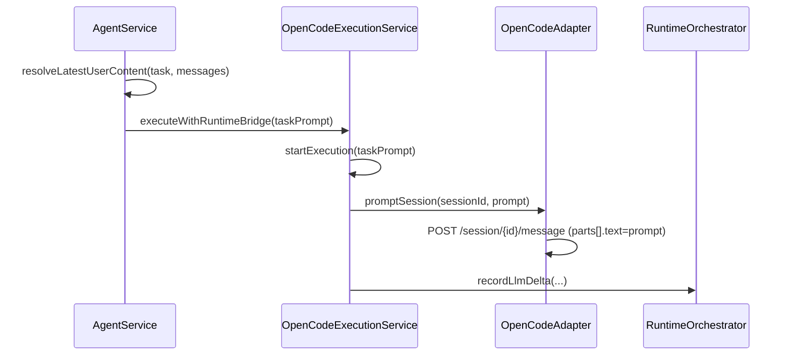
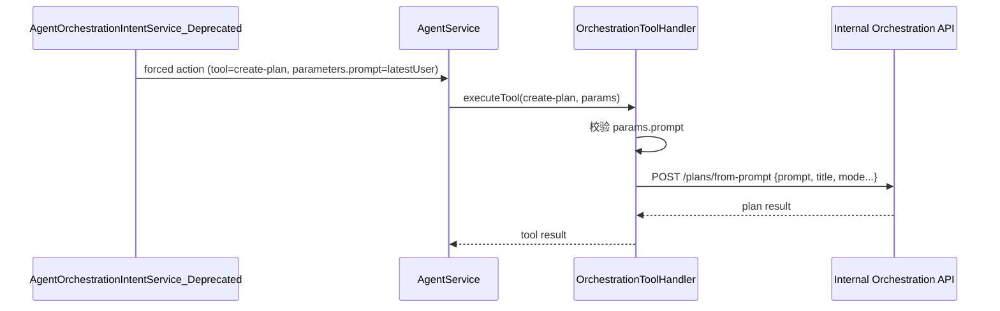

# Agents Prompt Context Callchain

## 1. 术语说明

- 本文统一使用 `prompt`。

## 2. 结论速览

- `backend/apps/agents` 中，prompt 注入上下文主要分为 4 类：
  1. Agent 级系统提示词：`agent.systemPrompt`。
  2. 工具级提示词：`tool.prompt`（按已授权工具注入 system 消息）。
  3. 用户任务提示词：`taskPrompt`（取最近 user 内容，主要给 OpenCode）。
  4. 编排提示词：`orchestration.create/update` 的 `prompt`（透传到编排 API，不直接进入 LLM `messages`）。
- Prompt 最终有两类消费路径：
  - 进入 LLM `messages`（native/streaming chat）。
  - 进入 OpenCode message body（`parts[].text`）或编排 API payload。
- Runtime 侧会持久化两类上下文：
  - system 消息快照（session）。
  - userContent（run）。

## 3. Prompt 类型与写入点矩阵

| Prompt 类型 | 来源 | 写入点 | 是否进入 LLM `messages` | 是否持久化到 Runtime | 主要代码位置 |
|---|---|---|---|---|---|
| `systemPrompt` | Agent 配置字段 | `buildMessages()` 首条 system 消息 | 是 | 是（session system messages） | `backend/apps/agents/src/modules/agents/agent.service.ts:1144` |
| `tool.prompt` | Tool 配置/内置目录 | `buildToolPromptMessages()` -> system 消息追加 | 是 | 是（session system messages） | `backend/apps/agents/src/modules/agents/agent.service.ts:1203`, `backend/apps/agents/src/modules/agents/agent.service.ts:1265` |
| `taskPrompt` | 最近 user 消息（无则 description/title） | OpenCode 执行入参 | 否（不走 messages 队列） | 间接（run.userContent） | `backend/apps/agents/src/modules/agents/agent.service.ts:821`, `backend/apps/agents/src/modules/opencode/opencode-execution.service.ts:30`, `backend/apps/agents/src/modules/opencode/opencode.adapter.ts:41` |
| `orchestration create prompt` | 会议/用户指令 | orchestration tool payload `prompt` | 否 | 否（由编排服务侧处理） | `backend/apps/agents/src/modules/agents/agent-orchestration-intent.service.ts:80`（历史项，文件已于 2026-03-19 删除）, `backend/apps/agents/src/modules/tools/orchestration-tool-handler.service.ts:216` |
| `orchestration update prompt` | 用户更新计划入参 | orchestration API payload `sourcePrompt` | 否 | 否（由编排服务侧处理） | `backend/apps/agents/src/modules/tools/orchestration-tool-handler.service.ts:294`, `backend/apps/agents/src/modules/tools/orchestration-tool-handler.service.ts:299` |

## 4. 调用链图

### 4.1 普通执行（Native，含工具调用）



### 4.2 流式执行（Streaming）



### 4.3 OpenCode 执行（taskPrompt 路径）



### 4.4 编排计划执行（Orchestration Prompt 透传）



## 5. 场景化梳理（哪些逻辑会“填入 prompt”）

### 5.1 Agent 系统提示词注入

1. Agent 创建/更新时维护 `systemPrompt`（默认值会自动补齐）。
2. 任务执行进入 `buildMessages()` 后，`systemPrompt` 被写入第一条 `system` 消息。
3. 该 system 消息参与模型调用，并会被追加到 runtime session。

关键位置：

- `backend/apps/agents/src/modules/agents/agent.service.ts:224`
- `backend/apps/agents/src/modules/agents/agent.service.ts:1144`
- `backend/apps/agents/src/modules/agents/agent-executor-runtime.service.ts:67`

### 5.2 工具提示词（tool.prompt）注入

1. 内置工具目录可定义 `prompt`。
2. Tool 初始化时把 `prompt` 同步到工具文档（DB）。
3. Agent 执行时读取已授权工具，提取非空 `tool.prompt`，拼装为 `工具使用策略（toolId）` 的 system 消息。
4. 这些 system 消息进入 LLM `messages`，并落入 runtime session。

关键位置：

- `backend/apps/agents/src/modules/tools/builtin-tool-catalog.ts:91`
- `backend/apps/agents/src/modules/tools/tool.service.ts:481`
- `backend/apps/agents/src/modules/agents/agent.service.ts:1203`
- `backend/apps/agents/src/modules/agents/agent.service.ts:1265`

### 5.3 OpenCode 的 taskPrompt 填充

1. 在 detailed/streaming 执行中，如果命中 OpenCode 通道，都会先取 `resolveLatestUserContent()`。
2. 该内容作为 `taskPrompt` 传入 OpenCode 执行服务。
3. Adapter 最终将其写入 `/session/{id}/message` 的 `parts[].text`。

关键位置：

- `backend/apps/agents/src/modules/agents/agent.service.ts:821`
- `backend/apps/agents/src/modules/agents/agent.service.ts:1028`
- `backend/apps/agents/src/modules/opencode/opencode-execution.service.ts:30`
- `backend/apps/agents/src/modules/opencode/opencode.adapter.ts:41`

### 5.4 编排场景 prompt 透传

1. 会议意图识别命中“创建计划”时，强制工具调用参数中写入 `prompt: latestUser`。
2. Orchestration handler 校验 `prompt` 并透传到 `/plans/from-prompt`。
3. 更新计划场景会把 `params.prompt` 转写为 `payload.sourcePrompt`。
4. 该类 prompt 不进入 Agent LLM `messages`，而是作为编排服务输入。

关键位置：

- `backend/apps/agents/src/modules/agents/agent-orchestration-intent.service.ts:80`（历史项，文件已于 2026-03-19 删除）
- `backend/apps/agents/src/modules/tools/orchestration-tool-handler.service.ts:192`
- `backend/apps/agents/src/modules/tools/orchestration-tool-handler.service.ts:216`
- `backend/apps/agents/src/modules/tools/orchestration-tool-handler.service.ts:299`

## 6. Runtime 持久化视角（排查“到底注入了什么”）

可从两条线并行验证：

1. **System Prompt 注入是否生效**
   - 查看 runtime session 中追加的 system 消息（来源标记 `source=buildMessages`）。
   - 关键入口：`backend/apps/agents/src/modules/agents/agent-executor-runtime.service.ts:67`。

2. **用户 Prompt（taskPrompt/userContent）是否生效**
   - 查看 run 的 `userContent`（来自 `resolveLatestUserContent`）。
   - 关键入口：`backend/apps/agents/src/modules/agents/agent-executor-runtime.service.ts:105`。

## 7. 常见误区

- 误区 1：`orchestration prompt` 会进入模型消息上下文。  
  实际：多数编排 prompt 直接透传给 Orchestration API，不进入 `messages`。

- 误区 2：只有 `systemPrompt` 才是“提示词”。  
  实际：`tool.prompt` 同样会被注入 system 消息，且优先级高于自由生成时的策略解释。

- 误区 3：OpenCode 与 native 路径都吃同一份 `messages`。  
  实际：OpenCode 核心输入走 `taskPrompt`，native/streaming 才直接用 `messages`。

## 8. Prompt Registry 已注册场景与默认 Prompt

系统通过 `PromptResolverService` 对以下 `scene + role` 组合进行动态解析。  
解析优先级：`session override > DB(published) > Redis cache > code default`。  
当高优先级来源无内容时，自动回退到下方列出的 **code default**（代码硬编码默认值）。

### 8.1 场景与角色枚举

定义位置：`backend/src/modules/prompt-registry/prompt-resolver.constants.ts`

| scene | role | 用途 | 调用位置 |
|---|---|---|---|
| `meeting` | `meeting-execution-policy` | 会议执行策略（分配闭环、回执格式、确认规则） | `agent.service.ts:1615` |
| `orchestration` | `planner-task-decomposition` | 计划编排任务拆解（需求→JSON 任务清单） | `planner.service.ts:244` |

### 8.2 默认 Prompt 内容

#### `meeting` / `meeting-execution-policy`

来源常量：`DEFAULT_MEETING_EXECUTION_POLICY_PROMPT`（`agent.service.ts:204`）

```text
会议执行规则：
1) 一次确认后自动执行：用户已明确同意时，直接执行，不再二次确认语气或文案。
2) 分配类动作按闭环顺序执行：先 requirement 状态/分配，再发送通知。
3) 回执必须三段式：动作1（已分配）+ 动作2（已通知）+ 下一步检查点（预计时间）。
4) 通知默认使用短版开工文案；仅当用户明确要求时再补充验收细节。
5) 分配类动作目标 1 轮闭环，最晚不超过 2 轮。
```

**注入时机**：`buildMessages()` 中检测到 `meetingLikeTask` 为 true 时注入为 system 消息。  
**会话覆盖**：支持 `teamContext.promptOverrides` 作为 `sessionOverride`。  
**去重策略**：通过 `resolveSystemContextBlockContent()` 做 fingerprint + delta 注入，内容无变化不重复注入。

#### `orchestration` / `planner-task-decomposition`

来源常量：`DEFAULT_PLANNER_TASK_DECOMPOSITION_PROMPT`（`planner.service.ts:24`）

```text
将用户需求拆解为可执行任务清单并返回 JSON。
需求: {{prompt}}
输出规则:
1) 仅输出 JSON，不要附加解释。
2) JSON 结构: {"mode":"sequential|parallel|hybrid","tasks":[{"title":"","description":"","priority":"low|medium|high|urgent","dependencies":[0]}]}
3) tasks 数量 3-8 条。
4) dependencies 为当前任务依赖的前置任务索引数组。
5) mode 优先使用 {{mode}}。
5.1) {{requirementScope}}
6) 若存在发送邮件/外部动作任务，优先依赖"邮件草稿/内容生成"任务，而不是"校对/润色"任务，避免过度阻塞。
7) 若需求涉及编排/分配/通知，最后一个任务应为"汇总输出编排结果 JSON"。
```

**模板变量**：

| 变量 | 说明 | 来源 |
|---|---|---|
| `{{prompt}}` | 用户原始需求文本 | `planFromPrompt()` 入参 |
| `{{mode}}` | 执行模式：`sequential` / `parallel` / `hybrid` | 入参或默认 `hybrid` |
| `{{requirementScope}}` | 需求范围约束（有 requirementId 时提示围绕该需求闭环） | `resolvePlannerTaskPrompt()` 内部拼装 |

**渲染逻辑**：`renderPlannerPromptTemplate()` 替换占位符；若模板缺少某占位符，自动在末尾补齐兜底行，保证兼容旧模板。

### 8.3 新增场景指引

若需新增 `scene + role` 组合：

1. 在 `prompt-resolver.constants.ts` 的 `PROMPT_SCENES` / `PROMPT_ROLES` 中注册枚举值。
2. 在业务代码中定义 `DEFAULT_xxx_PROMPT` 常量作为 code default。
3. 调用 `promptResolver.resolve({ scene, role, defaultContent })` 获取最终内容。
4. 在 Prompt 管理页（`/prompt-registry`）创建草稿并发布，即可覆盖代码默认值。
5. 更新本文档第 8 节的场景矩阵与默认 Prompt 内容。

## 9. 代码索引（快速跳转）

- `backend/apps/agents/src/modules/agents/agent.controller.ts:160`
- `backend/apps/agents/src/modules/agents/agent.service.ts:748`
- `backend/apps/agents/src/modules/agents/agent.service.ts:1133`
- `backend/apps/agents/src/modules/agents/agent.service.ts:1203`
- `backend/apps/agents/src/modules/agents/agent.service.ts:1757`
- `backend/apps/agents/src/modules/agents/agent-executor-runtime.service.ts:54`
- `backend/apps/agents/src/modules/agents/agent-executor-runtime.service.ts:98`
- `backend/apps/agents/src/modules/opencode/opencode-execution.service.ts:26`
- `backend/apps/agents/src/modules/opencode/opencode.adapter.ts:38`
- `backend/apps/agents/src/modules/agents/agent-orchestration-intent.service.ts:73`（历史项，文件已于 2026-03-19 删除）
- `backend/apps/agents/src/modules/tools/orchestration-tool-handler.service.ts:175`
- `backend/apps/agents/src/modules/tools/builtin-tool-catalog.ts:88`
- `backend/apps/agents/src/modules/tools/tool.service.ts:445`
