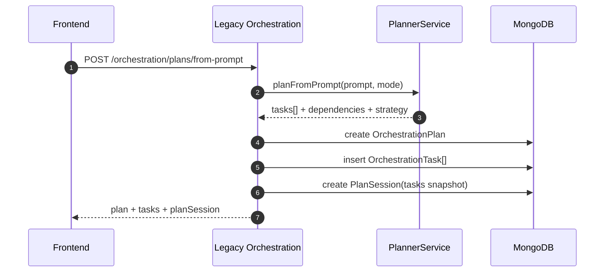
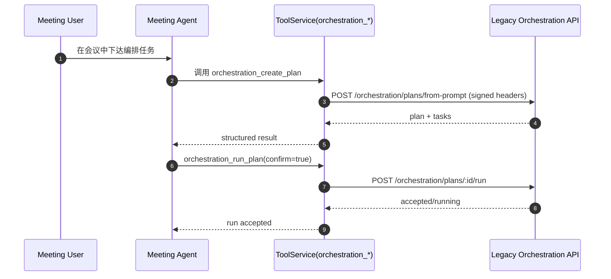
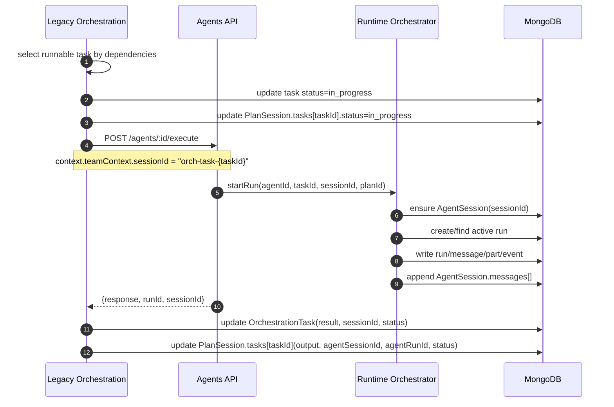
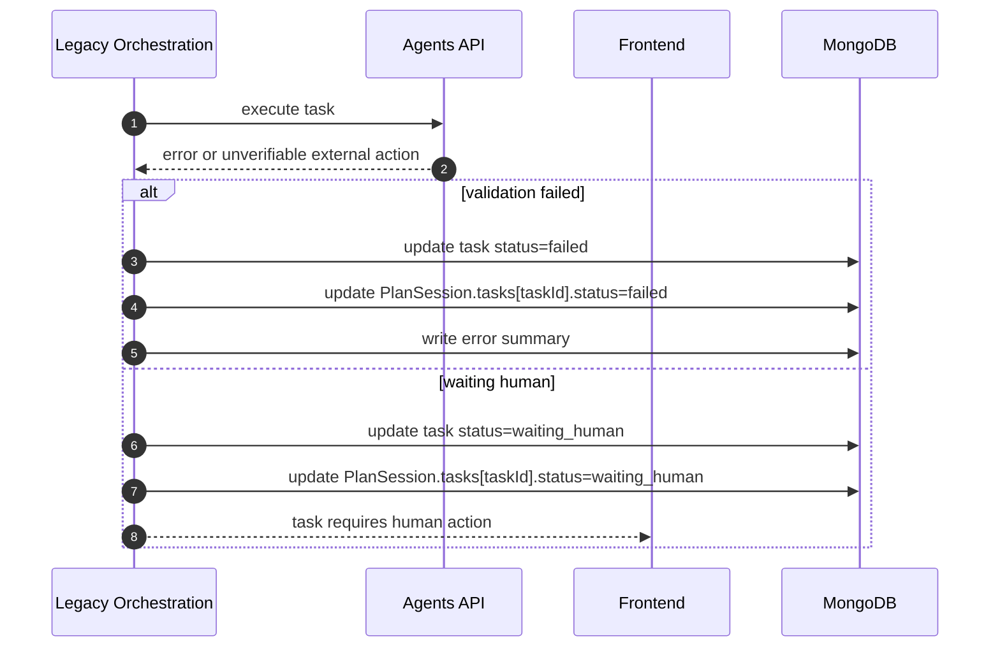
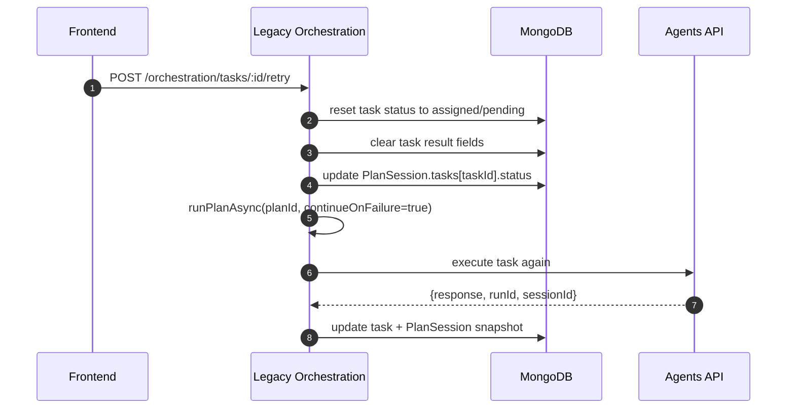
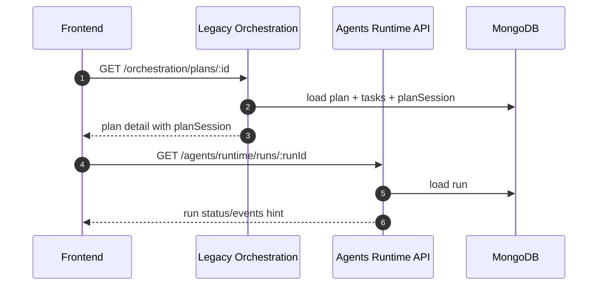

# [已弃用] AGENT_ORCHESTRATION_SEQUENCE_DIAGRAMS

> 状态：已弃用（2026-03-24）
>
> 说明：该文档为历史方案/设计沉淀，仅用于归档追溯，不再作为当前实现依据。
> 当前实现请以 `docs/guide/ORCHESTRATION_SERVICE_SPLIT_RUNTIME.MD` 与 `docs/feature/ORCHETRATION_TASK.md` 为准。
# Agent Orchestration 时序图

## 1. Plan 创建时序

---

## 1.1 会议中通过 MCP 触发编排

---

## 2. Task 执行时序（每个 Task 一个 Session）

---

## 3. 失败/人工接管时序

---

## 4. 失败任务重试时序

---

## 5. 查询与排障时序

---

## 6. 说明

- `PlanSession` 是编排视图，不记录工具调用细节。
- `AgentSession.messages` 是会话主消息流，便于会议/编排直接获取上下文。
- 工具调用/流式 token/事件状态在 runtime 数据层（run/message/part/outbox）。
- 推荐排障路径：`planSession.task -> agentRunId -> runtime run/outbox`。
